```{r setup, include=FALSE}
knitr::opts_chunk$set(echo = TRUE)
MODIS <- function(x) paste(round((x * 0.02) - 273.15, 2), "° C")
NOAA <- function(x) paste(round(x * 0.001, 2), "° C")
```

El objetivo de esta práctica es analizar la temperatura en Cancún desde el año 2001 al 2019 en 3 zonas:

  1. Ciudad.
  2. Vegetación cercana a la ciudad.
  3. Mar Caribe cercano a la ciudad y Laguna Nichupté.
  
Las temperaturas se tomaron de los siguientes conjuntos de datos:

  - Para la temperatura en ciudad y vegetación: *MOD11A1.006 Terra Land Surface Temperature and Emissivity Daily Global 1km*.
    - Los valores de temperatura se encuentran en Kelvin, y es necesario aplicarles un escalado. Por ello, para obtener los valores en Celsius se aplicará a cada valor la fórmula $Celsius = (x * 0.02) - 273.15$.
  - Para la temperatura en Mar y Laguna: *NOAA AVHRR Pathfinder Version 5.3 Collated Global 4km Sea Surface Temperature*.
    - Los valores de temperatura se encuentran en Celsius, pero es necesario aplicarles un escalado. Por ello, para obtener los valores en Celsius correctos se aplicará a cada valor la fórmula $Celsius = x * 0.001$.

## Series de tiempo

Las series de tiempo de la temperatura promedio en las 3 zonas mencionadas desde el año 2001 al 2019 son las siguientes:

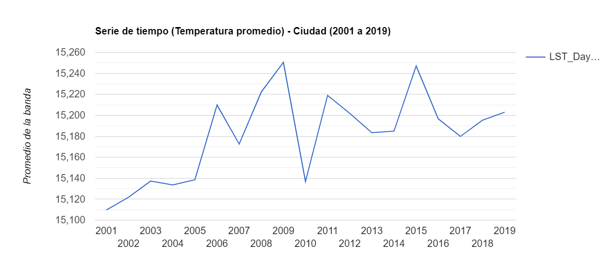

En esta gráfica:

  - Existen 2 picos altos en los años 2009 y 2015. Los valores de temperatura promedio en Celsius son de aproximadamente `r MODIS(15250)` y `r MODIS(15245)`, respectivamente.
  - Existe 1 pico bajo en el año 2010. El valor de temperatura promedio en Celsius es de aproximadamente `r MODIS(15135)`.

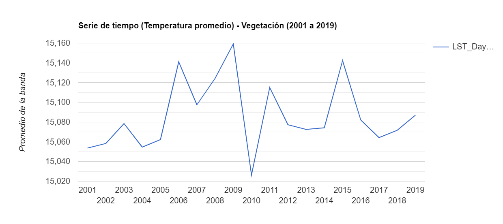

En esta gráfica:

  - Existe tres picos altos en los años 2006, 2009 y 2015. Sus valores de temperatura en Celsius son de aproximadamente `r MODIS(15140)`, `r MODIS(15160)` y `r MODIS(15145)`, respectivamente.
  - Existe un pico bajo en el año 2010. Su valor de temperatura en Celsius es de aproximadamente `r MODIS(15030)`.

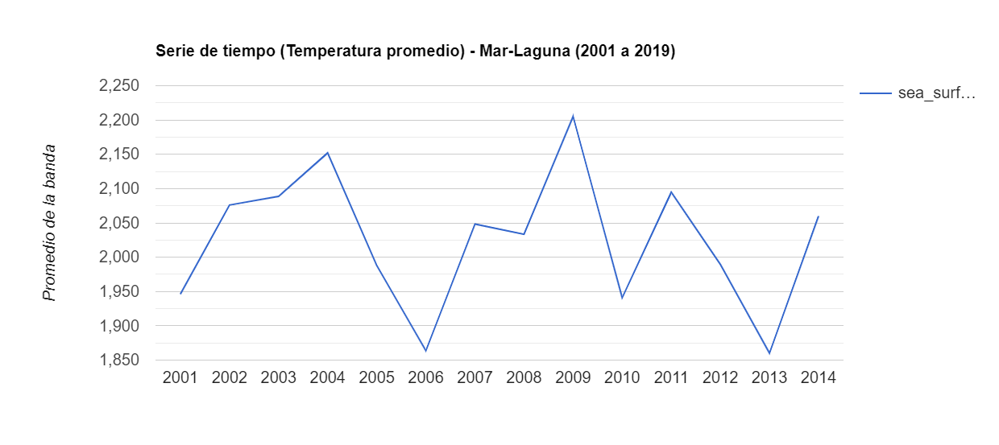

En esta gráfica:

  - Existe un pico alto en el año 2009. Su valor de temperatura en Celsius es de aproximadamente `r NOAA(2210)`.
  - Existe dos picos bajos en los años 2006 y 2013. Su valor de temperatura en Celsius es de aproximadamente `r NOAA(1860)`.

En general, en las 3 gráficas se pueden visualizar los siguientes fenómenos:

  - El comportamiento de la temperatura no es constante. A través de los años, la temperatura promedio en las 3 zonas aumenta y disminuye sin un patrón aparente.
  - El comportamiento de la temperatura promedio en la zona de vegetación y la ciudad es muy parecido. Ambos tienen en común picos altos en los años 2006, 2009 y 2015, y un pico bajo en el año 2010.
  - El comportamiento de la temperatura promedio en la zona del mar y laguna tiene cambios más drásticos a través de los años. Tiene un pico alto en el año 2009, y dos picos bajos en los años 2006 y 2013.

Se analizará el comportamiento de las 3 zonas en los años antes mencionados (2006, 2009, 2010, 2013 y 2015).

## Año 2006

En este año, la temperatura promedio de la zona de ciudad y vegetación es mayor respecto a la zona de mar y laguna. El mapa con las temperaturas promedio en las 3 zonas se visualiza a continuación.

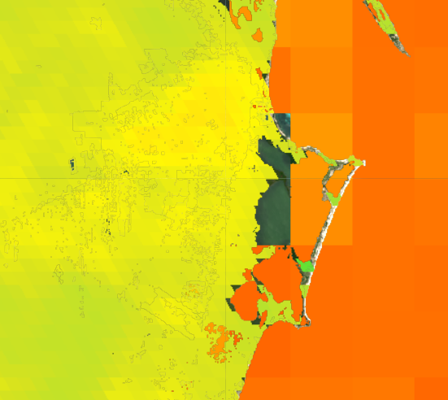

En la zona de ciudad, la temperatura promedio se visualiza en el siguiente mapa:


La distribución de la temperatura promedio en la zona ciudad tiene los siguientes valores:

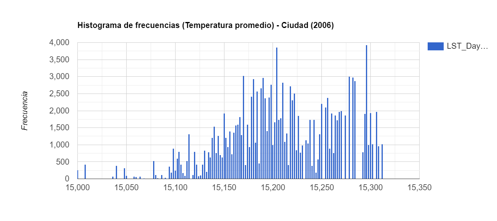

En el histograma, y convirtiendo los valores a grados Celsius, las temperaturas promedio más frecuentes son de aproximadamente `r MODIS(15200)` y `r MODIS(15300)`. Visualizando el mapa, estos valores debería estar localizados al centro de la ciudad.

En la zona de vegetación, la temperatura promedio se visualiza en el siguiente mapa:

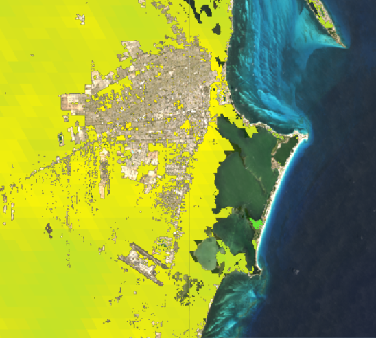

La distribución de la temperatura promedio en la zona de vegetación tiene los siguientes valores:

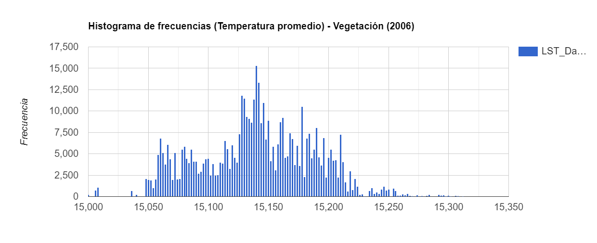

En el histograma, y convirtiendo los valores a grados Celsius, las temperatura promedio más frecuente es de aproximadamente `r MODIS(15175)`. En este caso, las temperaturas se mantienen un poco más bajas respecto a las temperaturas en la ciudad. Además, se visualizar que los zonas más calurosas aparecen en las zonas que colindan con la ciudad.

En la zona de mar y laguna, la temperatura promedio se visualiza en el siguiente mapa:

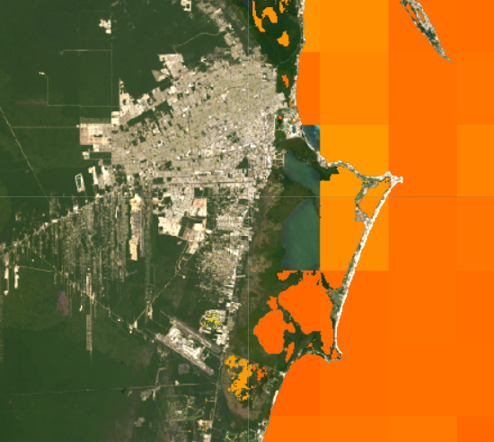

La distribución de la temperatura promedio en la zona de mar y laguna tiene los siguientes valores:

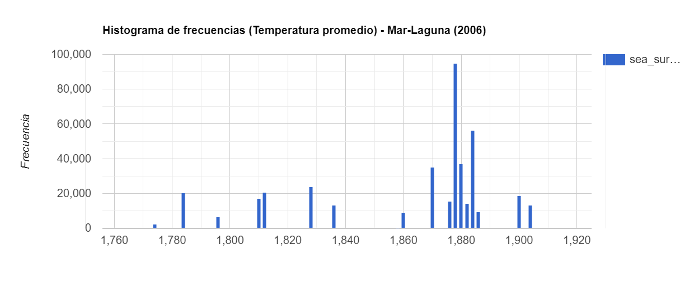

En este caso, el valor de temperatura promedio más frecuente es de aproximadamente `r NOAA(1879)`. Al ser una imagen con resolución menor, los valores disponibles son menores respecto a las otras zonas. Además, este año parece tener temperaturas más bajas respecto a los otros años.

## Año 2009

En este año, la temperatura promedio de la zona de ciudad y vegetación es mayor respecto a la zona de mar y laguna. Respecto al año anterior (2008), las 3 zonas presentan temperaturas mucho más altas. El mapa con las temperaturas promedio en las 3 zonas se visualiza a continuación.

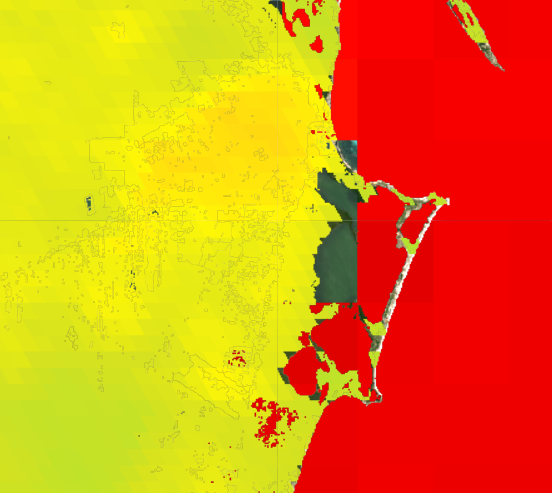

En la zona de ciudad, la temperatura promedio se visualiza en el siguiente mapa:

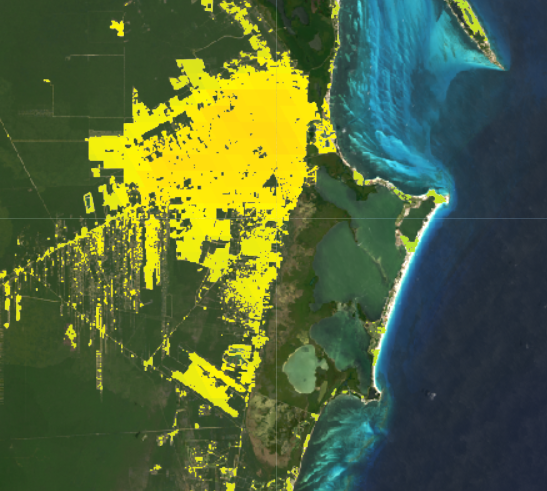

La distribución de la temperatura promedio en la zona de ciudad tiene los siguientes valores:


Este año, la temperatura promedio más frecuente en esta zona es de aproximadamente `r MODIS(15325)`, más alta que en el años 2006. Y, en general, la distribución de temperaturas tiene valores mayores respecto al año mencionado. Nuevamente las zonas más calientes parecen encontrarse al centro de la ciudad.

En la zona de vegetación, la temperatura promedio se visualiza en el siguiente mapa:


La distribución de la temperatura promedio en la zona de vegetación tiene los siguientes valores:

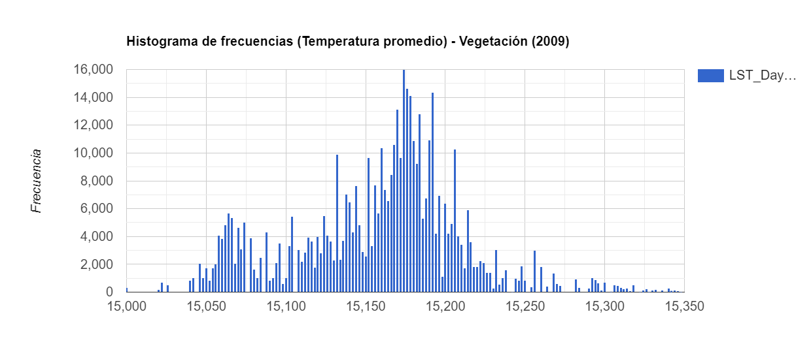

La temperatura promedio más frecuente en esta zona es de aproximadamente `r MODIS(15175)`. La distribución se ve muy parecida al año 2006, pero en este caso hay valores de temperatura altos con más valores de frecuencia que dicho año. De nuevo, las zonas más calientes parecen encontrarse en las zonas cercanas a la ciudad.

En la zona de mar-laguna, la temperatura promedio se visualiza en el siguiente mapa:

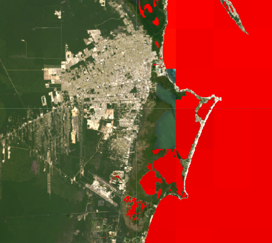

La distribución de la temperatura promedio en la zona vegetación tiene los siguientes valores:

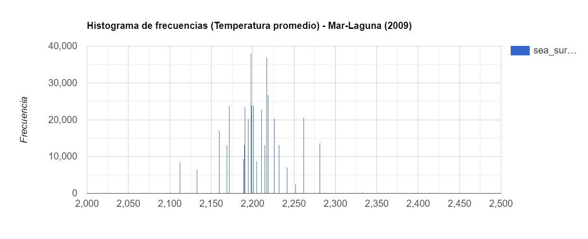

La temperatura promedio más frecuente es de aproximadamente `r NOAA(2200)`, más alta que el año 2006.

## Año 2010

En general, este año parece tener descensos de temperatura en las 3 zonas. El mapa con las temperaturas promedio en las 3 zonas se visualiza a continuación.

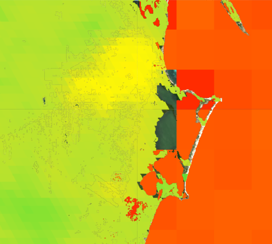

En la zona de ciudad, la temperatura promedio se visualiza en el siguiente mapa:

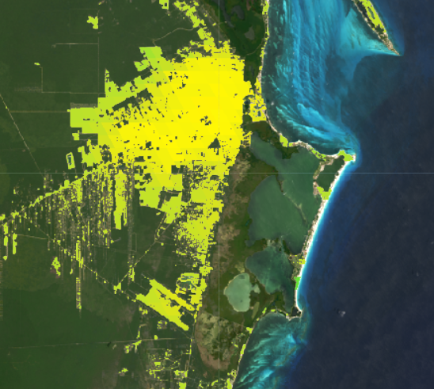

La distribución de la temperatura promedio en la zona de ciudad tiene los siguientes valores:

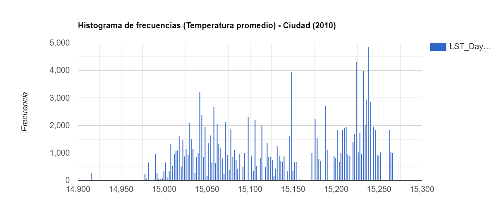

El valor de temperatura promedio más frecuente es de aproximadamente `r MODIS(15225)`, menor al año anterior, y la distribución se mueve de igual forma en rangos menores. Nuevamente, la zona más calurosa parece encontrarse al centro de la ciudad.

En la zona vegetación, la temperatura promedio se visualiza en el siguiente mapa:

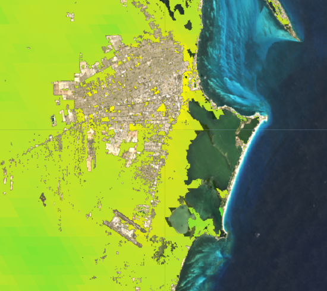

La distribución de la temperatura promedio en la zona vegetación tiene los siguientes valores:

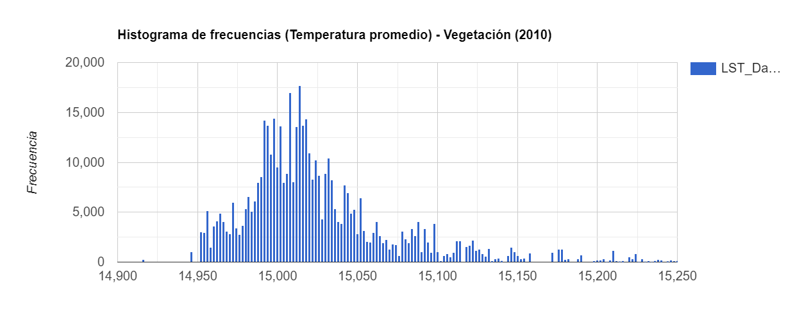

La temperatura promedio más frecuente es de aproximadamente `r MODIS(15025)`, menor que el año anterior. Además, resulta curioso ver que la distribución de temperatura tiende a ser normal. Sin embargo, parece tener algunos valores de temperatura altos aislados. Esos valores parecen encontrarse en la zona cercana a la entrada de la Zona Hotelera, por el kilómetro 0, y en algunas manchas al centro de la ciudad.

En la zona de mar-laguna, la temperatura promedio se visualiza en el siguiente mapa:

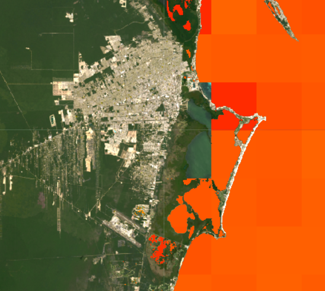

La distribución de la temperatura promedio en la zona de mar-laguna tiene los siguientes valores:

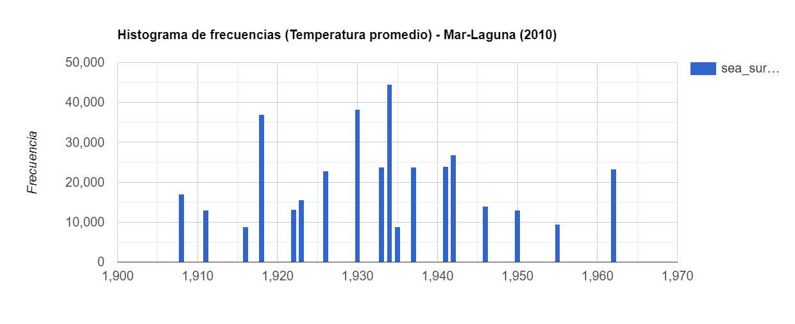

El valor de temperatura promedio más frecuente es de aproximadamente `r NOAA(1935)`, menor que el año anterior, y la distribución de valores también tiene un rango menor.

## Año 2013

Este año parece tener temperaturas promedio mayores en las zonas de ciudad y vegetación respecto al año anterior analizado. Sin embargo, la temperatura de la zona de mar-laguna tuvo un descenso drástico. El mapa con las temperaturas promedio en las 3 zonas se visualiza a continuación.

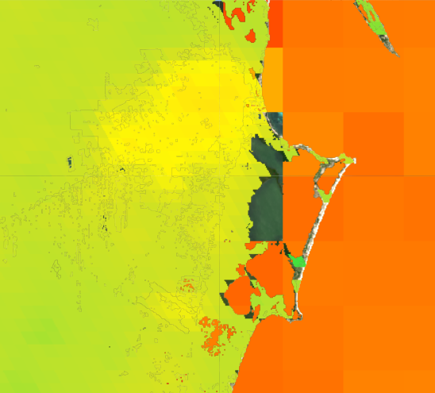

En la zona de ciudad, la temperatura promedio se visualiza en el siguiente mapa:


La distribución de la temperatura promedio en la zona ciudad tiene los siguientes valores:

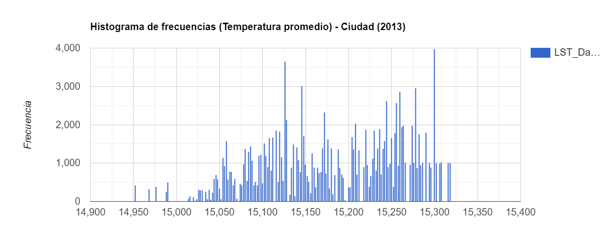

Las temperaturas promedio más frecuentes son de aproximadamente `r MODIS(15125)` y de `r MODIS(15300)`, mayores al año anterior analizado. Nuevamente esas temperaturas parecen registrarse al centro de la ciudad.

En la zona de vegetación, la temperatura promedio se visualiza en el siguiente mapa:

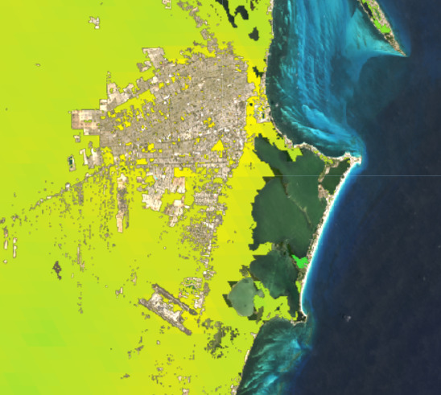

La distribución de la temperatura promedio en la zona de vegetación tiene los siguientes valores:

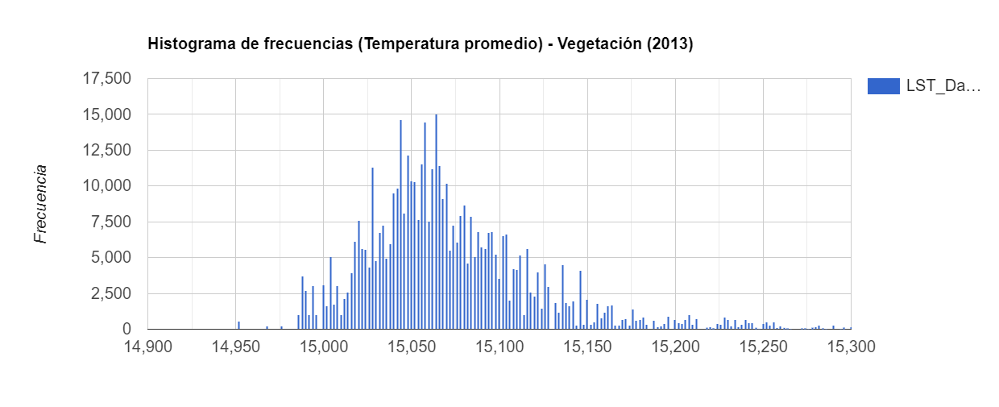

La temperatura promedio más frecuente es de aproximadamente `r MODIS(15075)`, mayor al año anterior analizado. Nuevamente las zonas cercanas a las ciudad son las que presentan los valores de temperatura promedio más altos.

En la zona de mar-laguna, la temperatura promedio se visualiza en el siguiente mapa:

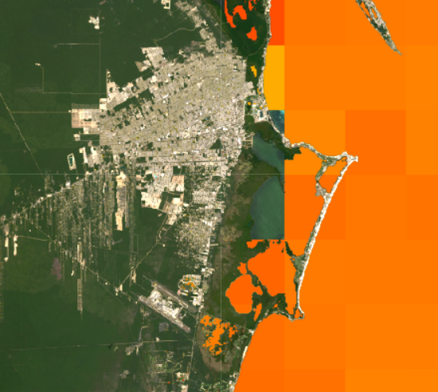

La distribución de la temperatura promedio en la zona de mar-laguna tiene los siguientes valores:

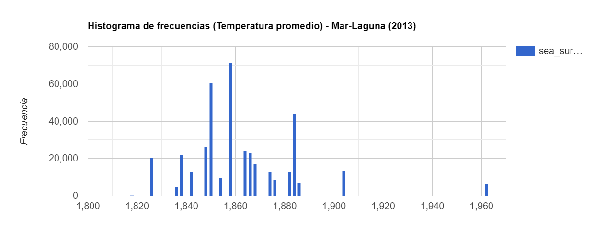

La temperatura promedio más frecuente es de `r NOAA(1860)`, menor a la del año anterior analizado. Sin embargo, parece existir un valor de temperatura promedio más alto que el resto.

## Año 2015

En este año, la temperatura promedio de la zona de ciudad y vegetación tiene aumentos importantes respecto al año anterior analizado y su año anterior (2014). En este caso no se cuenta con información de temperatura en la zona de mar-laguna. El mapa con las temperaturas promedio en las 2 zonas se visualiza a continuación.

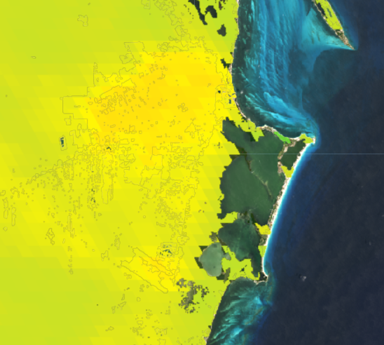

En la zona de ciudad, la temperatura promedio se visualiza en el siguiente mapa:


La distribución de la temperatura promedio en la zona de ciudad tiene los siguientes valores:

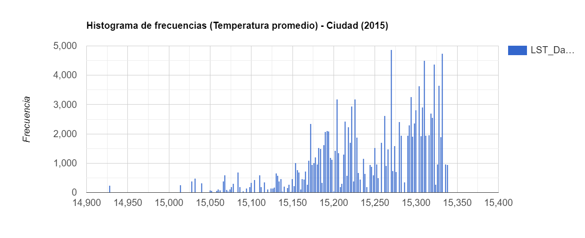

Este año tiene temperaturas promedio más calurosas frecuentes respecto al año anterior analizado. Sin embargo, la temperatura promedio más frecuente es menor, con un valor aproximado de `r MODIS(15275)`. En este caso, la temperaturas altas parecen abarcar una zona mayor dentro de la ciudad respecto al año anterior analizado.

Finalmente, en la zona de vegetación, la temperatura promedio se visualiza en el siguiente mapa:


La distribución de la temperatura promedio en la zona de vegetación tiene los siguientes valores:

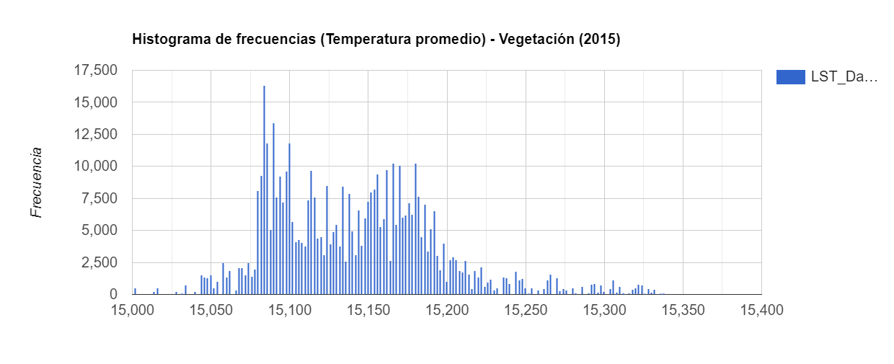

Al igual que en la ciudad, las temperaturas promedio son más calurosas en la zona de vegetación respecto al año anterior analizado. Sin embargo, el valor más frecuente es aproximadamente el mismo, de `r MODIS(15075)`. En este año, las temperaturas altas parecen abarcar un área mayor en esta zona.

## Conclusiones

Aunque con este breve análisis no se puede concluir que las temperaturas en Cancún aumenten año con año, lo que sí se puede visualizar es que las temperaturas promedio más calurosas comienzan a abarcar áreas mayores en cada zona, muy probablemente debido al crecimiento urbano que ha sufrido la ciudad a través de los años.
